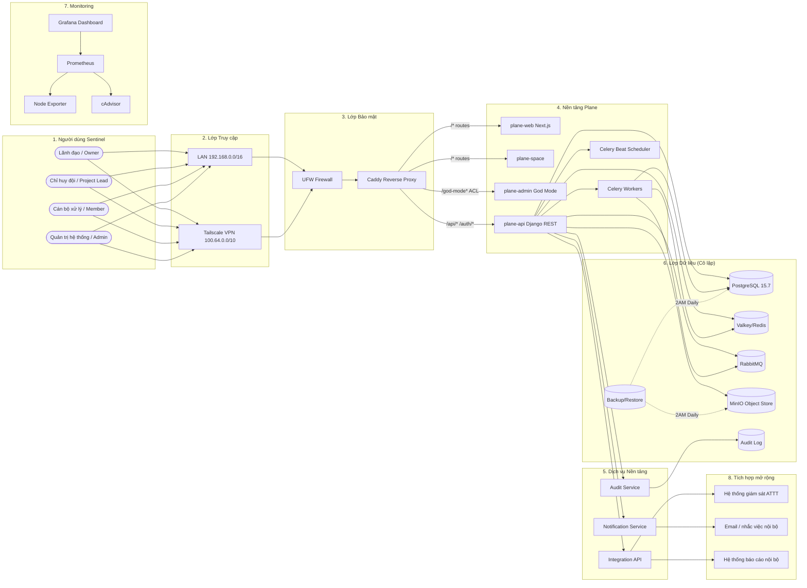
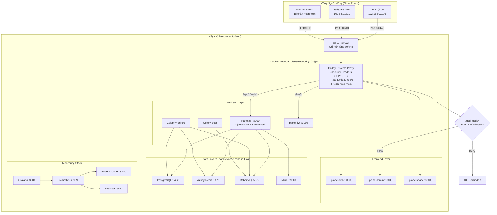
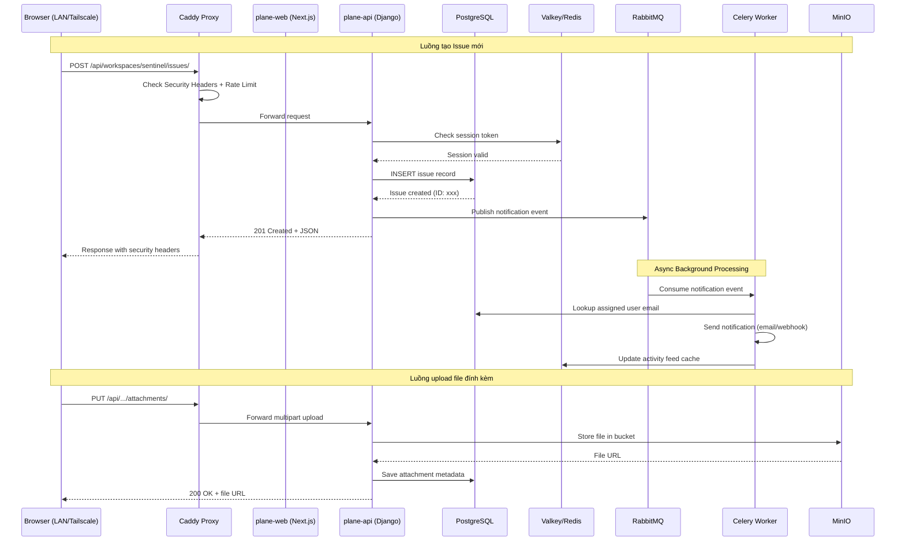
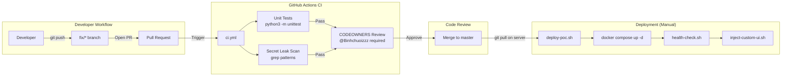

# Sentinel Taskboard — System Architecture

> Bản mô tả kiến trúc kỹ thuật tổng thể phục vụ triển khai, bảo trì và mở rộng hệ thống.

---

## 1. Sơ đồ Tổng thể Hệ thống (System Overview)



---

## 2. Sơ đồ Use Case (Actors & Functions)

```mermaid
graph TD
    Admin([System Admin / Owner])
    Lead([Project Lead / Commander])
    Member([Staff / Member])
    Guest([Guest / Viewer])
    Cron([Automated System])

    subgraph "Quản trị Hệ thống"
        UC01[Cấu hình Instance & God-Mode]
        UC02[Quản lý Workspace & Settings]
        UC03[Phân quyền RBAC & Cấp phát thành viên]
    end

    subgraph "Quản lý Dự án (PRJ1-PRJ7)"
        UC04[Tạo & Cấu hình Project]
        UC05[Thiết lập Workflow States & Labels]
        UC06[Quản lý Cycles / Sprints]
        UC07[Quản lý Modules / Epics]
    end

    subgraph "Cộng tác Hàng ngày"
        UC08[Tạo & Quản lý Issues / Tasks]
        UC09[Kanban Board / List / Calendar]
        UC10[Soạn thảo Pages / Wiki]
        UC11[Tải lên/xuống File đính kèm]
        UC12[Comment & Mention thành viên]
    end

    subgraph "Giám sát & Báo cáo"
        UC13[Dashboard Analytics]
        UC14[Theo dõi Tiến độ / Quá hạn]
        UC15[Xuất Báo cáo]
    end

    subgraph "Vận hành Hệ thống"
        UC16[Sao lưu DB & Object Store]
        UC17[Health Check & Monitoring]
        UC18[Khôi phục thảm họa]
    end

    Admin --> UC01 & UC02 & UC03 & UC04 & UC05
    Admin --> UC08 & UC13 & UC17

    Lead --> UC04 & UC05 & UC06 & UC07
    Lead --> UC08 & UC09 & UC10 & UC13 & UC14 & UC15

    Member --> UC08 & UC09 & UC10 & UC11 & UC12
    Member --> UC13 & UC14

    Guest --> UC13 & UC14 & UC15

    Cron --> UC16 & UC17 & UC18
```



---

## 3. Sơ đồ Kiến trúc Mạng & Biên Bảo mật (Network Security)



---

## 4. Sơ đồ Luồng Dữ liệu (Data Flow)



---

## 5. Sơ đồ Deployment Topology (Docker Compose)

```mermaid
graph TB
    subgraph "docker-compose.yaml (Orchestrator)"
        subgraph "docker-compose.proxy.yaml"
            Caddy["caddy:latest<br/>Ports: 80, 443"]
        end

        subgraph "docker-compose.app.yaml"
            Web["plane-web<br/>makeplane/plane-frontend"]
            Space["plane-space<br/>makeplane/plane-space"]
            AdminUI["plane-admin<br/>makeplane/plane-admin"]
            API["plane-api<br/>makeplane/plane-backend"]
            Worker["plane-worker<br/>makeplane/plane-backend"]
            Beat["plane-beat<br/>makeplane/plane-backend"]
            Live["plane-live<br/>makeplane/plane-backend"]
        end

        subgraph "docker-compose.db.yaml"
            PG["plane-db<br/>postgres:15.7-alpine"]
            Redis["plane-redis<br/>valkey/valkey:8"]
            MQ["plane-mq<br/>rabbitmq:4.1-alpine"]
            MinIO["plane-minio<br/>minio/minio"]
        end

        subgraph "docker-compose.monitor.yaml"
            Prom["prometheus<br/>prom/prometheus"]
            Grafana["grafana<br/>grafana/grafana"]
            NodeExp["node-exporter<br/>prom/node-exporter"]
            cAdv["cadvisor<br/>gcr.io/cadvisor"]
        end
    end

    subgraph "Volumes (Persistent Data)"
        V1[("pgdata")]
        V2[("redisdata")]
        V3[("uploads")]
        V4[("minio-data")]
        V5[("grafana-data")]
        V6[("prom-data")]
    end

    PG --- V1
    Redis --- V2
    API --- V3
    MinIO --- V4
    Grafana --- V5
    Prom --- V6
```



---

## 6. Sơ đồ CI/CD & DevOps Pipeline



---

## 7. RBAC Matrix (Phân quyền Chi tiết)

| Action | Admin | Project Lead | Member | Guest |
| :--- | :---: | :---: | :---: | :---: |
| God-Mode / Instance Settings | ✅ | ❌ | ❌ | ❌ |
| Create / Delete Workspace | ✅ | ❌ | ❌ | ❌ |
| Create / Delete Project | ✅ | ✅ | ❌ | ❌ |
| Manage Members & Roles | ✅ | ✅ (own project) | ❌ | ❌ |
| Configure Workflow & Labels | ✅ | ✅ (own project) | ❌ | ❌ |
| Create / Edit Issues | ✅ | ✅ | ✅ | ❌ |
| Delete Issues | ✅ | ✅ | ❌ | ❌ |
| Manage Cycles / Modules | ✅ | ✅ | ✅ | ❌ |
| Upload Attachments | ✅ | ✅ | ✅ | ❌ |
| Edit Pages / Wiki | ✅ | ✅ | ✅ | ❌ |
| View Dashboard & Analytics | ✅ | ✅ | ✅ | ✅ |
| Export Reports | ✅ | ✅ | ❌ | ✅ |

---

## 8. Technology Stack Summary

| Layer | Technology | Purpose |
| :--- | :--- | :--- |
| Reverse Proxy | Caddy Server | Routing, SSL, security headers, rate limiting, IP ACL |
| Frontend | Next.js (React) | Web UI, SSR dashboard |
| Backend API | Django REST Framework | RESTful API, authentication, business logic |
| Background Jobs | Celery + Celery Beat | Async tasks, notifications, scheduled jobs |
| Message Broker | RabbitMQ 4.1 | Task queue for Celery workers |
| Cache & Session | Valkey (Redis fork) 8.x | Session storage, activity feed cache |
| Database | PostgreSQL 15.7 | Primary relational data store (ACID) |
| Object Storage | MinIO | S3-compatible file attachment storage |
| Monitoring | Prometheus + Grafana | Metrics collection, dashboards, alerting |
| Host Metrics | Node Exporter + cAdvisor | System + container resource monitoring |
| Container Runtime | Docker + Docker Compose | Service orchestration (PoC) |
| Production Orchestration | Kubernetes | HA deployment, auto-scaling (Phase 8) |
| CI/CD | GitHub Actions | Unit tests, secret scanning, code review |
| VPN | Tailscale | Zero-trust remote access |
| Firewall | UFW | Host-level port filtering |
| Backup | pg_dump + tar + cron | Automated daily backup with retention |

---

## 9. Project Directory Structure

```
sentinel-taskboard/
├── .github/
│   ├── CODEOWNERS                  # Owner review requirements
│   ├── PULL_REQUEST_TEMPLATE.md    # PR security checklist
│   └── workflows/
│       └── ci.yml                  # GitHub Actions CI pipeline
│
├── docs/                           # Architecture & deployment guides
│   ├── SYSTEM_ARCHITECTURE.md      # ← This file (diagrams)
│   ├── SYSTEM_SECURITY.md          # Security hardening details
│   ├── ACCESS_GUIDE.md             # User access documentation
│   ├── 00-MASTER-CHECKLIST.md      # 9-phase deployment checklist
│   ├── 01-prerequisites.md         # Server requirements
│   ├── 02-poc-deployment.md        # PoC setup guide
│   ├── 03-configuration.md         # Workspace & project config
│   ├── 04-production.md            # Kubernetes production guide
│   ├── 05-security.md              # Security hardening guide
│   ├── 06-backup-restore.md        # Backup & DR procedures
│   ├── 07-monitoring.md            # Prometheus/Grafana setup
│   └── 08-onboarding.md            # Team onboarding plan
│
├── env/                            # Environment configuration
│   ├── .env.example                # Template (safe to commit)
│   ├── .env.local                  # Actual secrets (git-ignored)
│   └── .gitignore
│
├── plane-app/                      # Docker Compose deployment
│   ├── docker-compose.yaml         # Main orchestrator
│   ├── docker-compose.app.yaml     # Application services
│   ├── docker-compose.db.yaml      # Database services
│   ├── docker-compose.proxy.yaml   # Caddy proxy
│   ├── docker-compose.monitor.yaml # Monitoring stack
│   ├── Caddyfile                   # Reverse proxy config
│   └── custom-ui.css               # UI theme injection
│
├── k8s/                            # Kubernetes manifests (Phase 8)
│   ├── namespace.yaml
│   ├── ingress.yaml
│   ├── plane-deployment.yaml
│   ├── postgres-statefulset.yaml
│   └── redis-deployment.yaml
│
├── monitoring/                     # Monitoring configuration
│   ├── prometheus.yml              # Scrape targets
│   ├── alert-rules.yml             # Alert conditions
│   └── grafana/
│       ├── dashboards/             # JSON dashboard definitions
│       └── provisioning/           # Auto-provisioning configs
│
├── scripts/                        # Automation scripts
│   ├── deploy-poc.sh               # Full stack deployment
│   ├── backup.sh                   # Automated backup
│   ├── restore.sh                  # Disaster recovery
│   ├── health-check.sh             # Service health verification
│   ├── check-prerequisites.sh      # Environment validation
│   ├── inject-custom-ui.sh         # UI theme injection
│   ├── setup-cron.sh               # Cron job installation
│   ├── initialize-plane-data.py    # Workspace/project seeding
│   ├── setup_plane_app_env.py      # Environment file generator
│   └── setup_plane_envs.py         # Multi-env setup utility
│
├── tests/
│   ├── unit/                       # Unit tests (no server needed)
│   │   ├── test_env_generator.py
│   │   └── test_ui_injector.py
│   └── integration/                # Integration tests (server required)
│       └── test_full_integration.py
│
├── backup/                         # Backup storage (git-ignored)
│   └── daily/
│
├── .gitignore                      # Comprehensive secret exclusions
├── CONTRIBUTING.md                 # Collaborator onboarding guide
├── SECURITY.md                     # Vulnerability disclosure policy
├── README.md                       # Project overview & quick start
└── pyrightconfig.json              # Python type checking config
```
